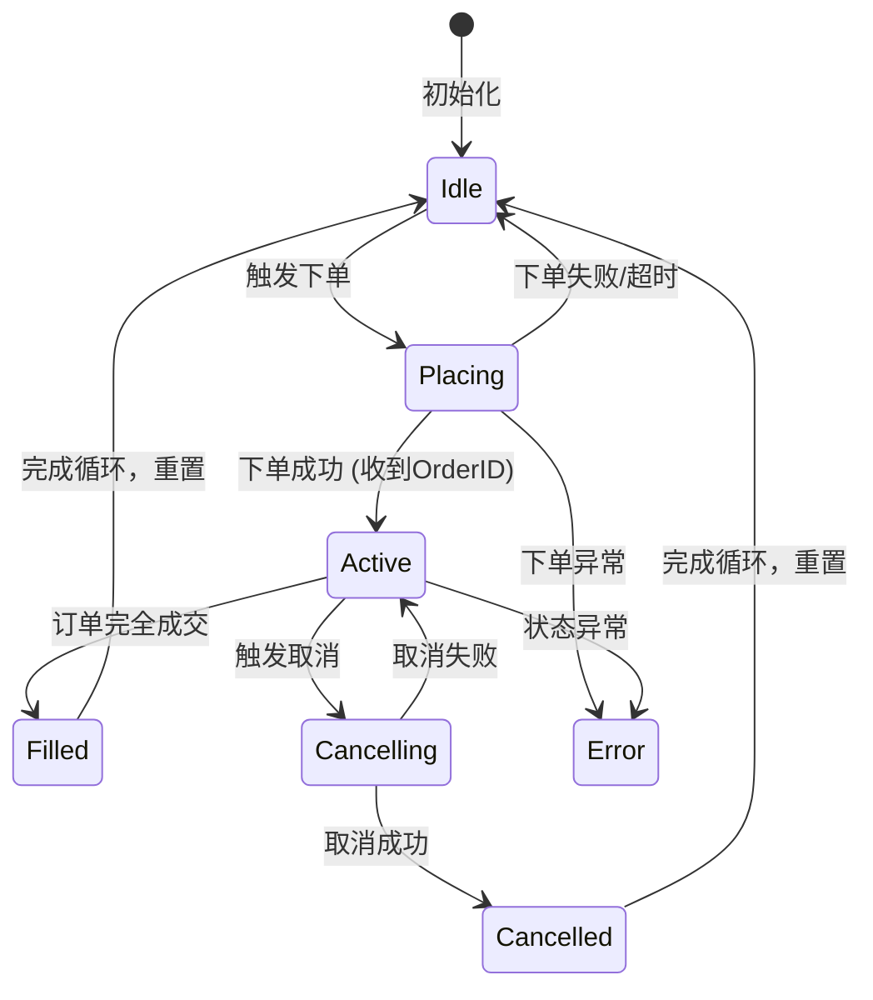
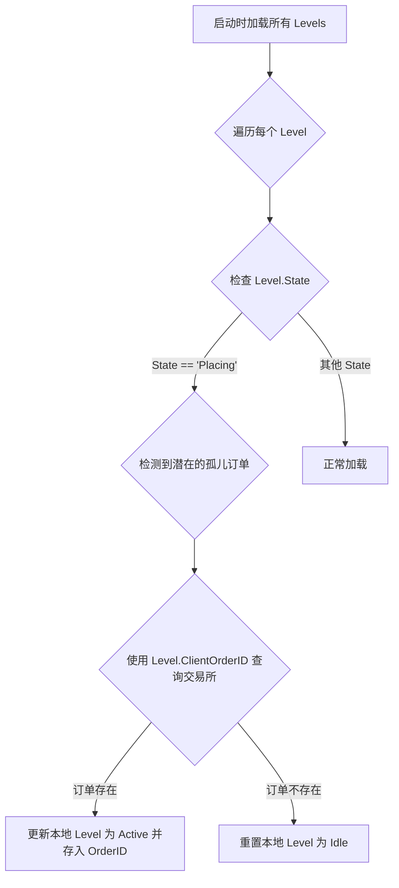

# 网格算法核心设计重构与优化建议

**版本**: 2.0
**作者**: Roo (资深量化交易系统架构师)
**摘要**: 本文档基于 `v1.5` 版本的设计，采纳并深化了 `1.3.1` 节的全部改进建议，对第一部分“核心原理与数据结构”进行了彻底重构。新设计将状态机、客户端订单ID和幂等性检查内建为核心机制，旨在从根本上提升系统的健壮性、可恢复性和逻辑清晰度。此外，本文档新增了对当前设计的深入分析，并提出了一系列具体、可操作的进阶优化方案，以期在实战中提升策略的适应性和盈利能力。

---

### **第一部分：重构后的核心原理与数据结构**

本部分将原有的设计与改进建议融合，形成一个更健壮、更具实战性的统一设计。

#### **1.1 核心数学原理**

本策略采用基于**回归价格（Reversion Price）**的几何网格算法，其核心逻辑如下：

1.  **入场价格 (`entryPrice`)**: 以机器人启动时的**当前市价**作为基准。
2.  **回归价格 (`reversionPrice`)**: 根据配置的**回归率 (`return_rate`)** 计算出理论上的价格回归目标，此价格被视为网格的**最高点（上界）**。
    *   **公式**: `reversionPrice = entryPrice * (1 + return_rate)`
3.  **理论网格生成 (`conceptualGrid`)**:
    *   以 `reversionPrice` 为起点，按照固定的几何间距 (`gridSpacing`)，**单向向下**生成一系列价格水平。
    *   **价格水平公式**: `P_n = reversionPrice / (1 + gridSpacing)^n` (其中 n = 0, 1, 2, ...)
    *   生成过程持续，直至下一个计算出的价格低于 `entryPrice / 2` 时停止，形成完整的理论网格。

该设计的核心思想是动态捕捉从入场价到目标回归价之间的价格波动。

#### **1.2 [重构] 核心数据结构与状态机**

为实现一个健壮且可观测的系统，我们将显式的**状态机**整合进核心数据结构中。

```go
package gridpricer

// GridLevelState 定义了网格水平所有可能的状态
type GridLevelState string

const (
    StateIdle       GridLevelState = "Idle"       // 空闲，可随时下单
    StatePlacing    GridLevelState = "Placing"    // 下单中，等待交易所确认
    StateActive     GridLevelState = "Active"     // 已挂单，在市场中生效
    StateFilled     GridLevelState = "Filled"     // 订单完全成交
    StateCancelling GridLevelState = "Cancelling" // 取消中，等待交易所确认
    StateCancelled  GridLevelState = "Cancelled"  // 订单已取消
    StateError      GridLevelState = "Error"      // 出现错误，需人工干预
)

// Level 代表一个网格价格水平的完整状态。
// 这是系统的核心原子单元。
type Level struct {
    GridID        int            `json:"grid_id"`        // 在理论网格中的唯一索引
    Price         float64        `json:"price"`          // 该水平的价格
    State         GridLevelState `json:"state"`          // **核心状态机字段**
    Side          OrderSide      `json:"side"`           // 挂单方向 (Buy or Sell)
    
    // --- 订单关联与恢复的关键字段 ---
    OrderID       int64          `json:"order_id"`       // 交易所生成的订单ID (下单成功后填充)
    ClientOrderID string         `json:"client_order_id"`// **本地生成的唯一ID，用于防重和恢复**
    
    // --- 幂等性控制 ---
    LastTradeID   string         `json:"last_trade_id"`  // **最后处理的成交事件ID，防止重复处理**
    
    // --- 统计与审计 ---
    FilledQuantity float64        `json:"filled_quantity"`// 累计成交数量
    UpdatedAt     int64          `json:"updated_at"`     // 状态最后更新时间戳
}

// Grid 是算法模块的核心状态机。
type Grid struct {
    config         Config
    conceptualGrid []Level   // 理论上的完整网格（包含所有价格水平）
    lastPrice      float64   // 最新成交价
}

// 其他数据结构如 Config, OrderPlacementInstruction 等保持不变
```

**网格水平状态机（Grid Level State Machine）:**

每个 `Level` 都遵循一个严格的生命周期，确保其在任何时刻都处于一个明确定义的状态。



#### **1.3 [重构] 订单生命周期与关联机制**

我们采用一种结合了**客户端订单ID（Client Order ID）**和**状态预写**的策略，从根本上解决“孤儿订单”和事件重复处理的问题。

**1. 下单流程 (解决“孤儿订单”)**

1.  **生成ID并预写状态**:
    *   当决定在某个 `Level` 上下单时，首先在本地生成一个全局唯一的 `ClientOrderID` (例如: `grid-buy-123.45-ts-1678886400`)。
    *   将该 `Level` 的 `State` 更新为 `Placing`，并存入 `ClientOrderID`。
    *   **立即将此状态持久化（保存）到数据库**。

2.  **发送订单**:
    *   使用这个 `ClientOrderID` 向交易所API发送下单请求。

3.  **确认与最终化**:
    *   **成功**: 交易所确认订单后，返回其生成的 `OrderID`。我们将 `Level` 的 `State` 更新为 `Active`，存入 `OrderID`，并**再次持久化状态**。
    *   **失败**: 如果下单请求失败，将 `Level` 的 `State` 回滚至 `Idle` 并持久化。

**2. 重启恢复逻辑**

机器人重启时，通过加载持久化状态，可以完美恢复所有订单的真实状态：



**3. 成交事件处理 (保证幂等性)**

1.  **接收事件**: 当通过WebSocket收到订单成交事件时，该事件包含 `orderID` 和唯一的 `tradeID`。
2.  **查找Level**: 通过 `orderID` 找到对应的 `Level`。
3.  **幂等性检查**:
    *   **状态检查**: 检查 `Level.State` 是否为 `Active`。如果不是（例如是 `Filled` 或 `Cancelling`），说明该事件是重复的或过期的，**直接忽略**。
    *   **事件ID检查 (可选增强)**: 检查事件的 `tradeID` 是否与 `Level.LastTradeID` 相同。如果相同，**直接忽略**。
4.  **执行逻辑**: 如果检查通过，则执行对冲挂单等核心业务逻辑。
5.  **更新状态**: 将 `Level.State` 更新为 `Filled`，记录 `LastTradeID`，并持久化状态。

---

### **第二部分：设计分析与优化建议**

#### **2.1 现有设计优势总结**

*   **健壮性**: 引入状态机和 `ClientOrderID` 后，系统对崩溃、网络延迟和事件重复具有极强的容错能力。
*   **可观测性**: 每个网格水平都有明确的状态，极大地简化了调试和问题定位。
*   **逻辑解耦**: 算法核心逻辑与外部执行器（资金管理、交易所交互）职责分离清晰。

#### **2.2 潜在风险与改进空间分析**

尽管设计健壮，但从**策略有效性**角度看，仍存在以下可改进之处：

1.  **网格静态性 (Grid Staticity)**:
    *   **问题**: 网格一旦根据 `entryPrice` 生成，其价格区间就是固定的。如果市场价格长期、大幅度地偏离初始区间（例如，单边上涨或下跌），整个网格将变得无效，无法再进行任何交易，造成资金和机会的浪费。
    *   **影响**: 策略的生命周期有限，无法适应长期趋势。

2.  **资金利用率 (Capital Efficiency)**:
    *   **问题**: 所有网格的订单价值 (`OrderValue`) 都是固定的。距离当前市价很远的网格，其成交概率极低，但同样占用了与市价附近网格等量的资金（在保证金模式下为保证金），导致整体资金利用率不高。
    *   **影响**: 在有限的资金下，无法在最可能成交的区域集中火力。

3.  **参数敏感性 (Parameter Sensitivity)**:
    *   **问题**: 策略表现高度依赖于 `gridSpacing` 和 `return_rate` 等参数。这些参数通常需要人工设定，难以适应不同交易对和不同市场阶段（如高波动期 vs. 低波动期）的最优值。
    *   **影响**: 策略适应性差，需要频繁的人工干预和调优。

#### **2.3 进阶优化建议**

为解决上述问题，我提出以下具体、可操作的优化方案：

**建议一：引入动态网格调整 (Dynamic Grid Adjustment)**

*   **目标**: 让网格“跟随”市场，而不是被市场抛弃。
*   **方案**:
    1.  **定义“偏离”条件**: 设定一个触发器，例如：`当前价格 > reversionPrice` 或 `当前价格持续 N 个周期低于 pivotPrice`。
    2.  **重置逻辑**: 当触发器被激活时，系统可以执行“软重置”或“硬重置”。
        *   **软重置**: 取消所有挂单，以当前价格为新的 `entryPrice`，重新计算并部署网格。此方法保留现有持仓。
        *   **硬重置**: 清算所有持仓，完全重启策略。
    3.  **实现**: 在主 `Bot` 逻辑中增加一个监控模块，定期检查偏离条件。

#### **2.3.1 建议一实现：动态网格硬重置逻辑**

为落实“建议一”，我们选择“硬重置”方案，并设定 `当前价格 > reversionPrice` 为唯一触发条件。以下是详细的执行逻辑，它将被整合到 `Bot` 的核心流程中。

**1. 状态与触发点**

*   **新增状态锁**: 在 `Bot` 结构体中增加一个原子布尔标记 `isResetting`，初始值为 `false`。此标记用于防止在一次重置操作完成前，重复触发新的重置。
*   **触发位置**: 在 `Bot` 的主价格监控循环中，每次获取到最新的 `currentPrice` 后，立即进行检查。

**2. 核心检查逻辑 (伪代码)**

```go
// 在价格监控循环内
func onPriceUpdate(currentPrice float64) {
    // 检查条件：reversionPrice必须有效，当前价格超过它，并且当前未在重置过程中
    if bot.reversionPrice > 0 && currentPrice > bot.reversionPrice && !bot.isResetting.Load() {
        // 启动异步重置，避免阻塞价格监控
        go bot.performHardReset()
    }
}
```

**3. 硬重置执行流程 (`performHardReset` 方法)**

此方法将封装完整的硬重置操作，确保过程的原子性和健壮性。

```mermaid
graph TD
    A[开始硬重置] --> B[设置 isResetting = true]
    B --> C["记录日志:硬重置启动..."]
    C --> D[取消所有挂单]
    D --> E{取消是否成功?}
    E -- 成功 --> F[清算所有持仓]
    E -- 失败 --> X["记录严重错误并暂停Bot"]
    F --> G{获取当前持仓量}
    G -- "持仓>0" --> H[以市价单卖出所有持仓]
    G -- "持仓==0" --> I[跳过清算]
    H --> I
    I --> J[重置内部状态]
    J --> K["清空本地网格数据 &#91;grid, levels&#93;"]
    K --> L["重置周期相关变量 &#91;entryPrice, reversionPrice&#93;"]
    L --> M[以当前市价重启策略]
    M --> N["调用 enterMarketAndSetupGrid()"]
    N --> O{重启是否成功?}
    O -- "成功" --> P["记录日志，硬重置成功"]
    O -- "失败" --> Y["记录严重错误并暂停Bot"]
    P --> Q[设置 isResetting = false]
    Q --> R[结束]
    X --> Q
    Y --> Q
```



**4. 步骤详解**

1.  **锁定状态**:
    *   在方法开始时，立刻通过原子操作将 `isResetting` 设置为 `true`。
    *   使用 `defer` 语句确保在方法退出时（无论成功或失败），都将 `isResetting` 恢复为 `false`。

2.  **取消订单 (`cancelAllOrders`)**:
    *   调用此方法来取消交易所上所有与本策略相关的挂单。
    *   这是最关键的第一步，以防止在后续操作中产生非预期的成交。
    *   如果失败，必须记录严重错误并暂停机器人，等待人工干预。

3.  **清算持仓 (`liquidatePosition`)**:
    *   查询当前的基础资产持仓量。
    *   如果持仓量大于零，立即提交一个市价卖单（Market Sell Order）来清空所有头寸。
    *   **注意**: 必须处理好市价单的滑点和执行确认。

4.  **重置内部状态 (`resetInternalState`)**:
    *   将 `bot.grid` 设置为 `nil`。
    *   清理所有 `Level` 的状态。
    *   将 `bot.entryPrice` 和 `bot.reversionPrice` 等周期性变量重置为零。
    *   调用持久化模块，清除数据库中当前周期的状态。

5.  **重启策略 (`enterMarketAndSetupGrid`)**:
    *   完成清理后，调用此方法。
    *   该方法会获取最新的市价作为新的 `entryPrice`，重新计算 `reversionPrice`，生成新的理论网格，并在交易所部署新的初始订单。
    *   这标志着一个全新交易周期的开始。

通过以上设计，动态网格调整功能被无缝集成到现有框架中，确保了在市场发生趋势性突破时，策略能够自动适应，从而提高其鲁棒性和长期有效性。


---
**结论**:
通过上述重构，算法的核心框架在健壮性上得到了质的提升。结合提出的四点进阶优化建议，本网格交易系统将能更好地适应真实多变的市场环境，在控制风险的同时，有望实现更高的资金效率和策略适应性。

---

### **附录A：ClientOrderID 规范**

#### **A.1 格式规范 (Format Specification)**

`ClientOrderID` 采用分段式结构，通过连字符 `-` 连接，以确保高可读性和系统可解析性。其标准格式定义如下：

**格式**: `<StrategyID>-<OrderType>-<Timestamp>-<Nonce>`

*   **`StrategyID` (策略标识符)**
    *   **含义**: 唯一标识一个正在运行的网格交易策略实例。
    *   **格式**: 由小写字母和数字组成，建议能体现交易对和策略类型。
    *   **示例**: `btcusdtgrid`, `ethspot01`

*   **`OrderType` (订单类型)**
    *   **含义**: 描述订单的业务目的，便于快速分类和追踪。
    *   **格式**: 预定义的小写字符串。
    *   **预定义值**:
        *   `init`: 策略初始化时创建的订单。
        *   `buy`: 网格买入订单。
        *   `sell`: 网格卖出订单。
        *   `stop`: 止损或止盈触发的订单。

*   **`Timestamp` (时间戳)**
    *   **含义**: 订单创建时的UTC时间戳，以毫秒为单位。这保证了订单ID的唯一性和时间上的可排序性。
    *   **格式**: 13位数字的Unix毫秒时间戳。
    *   **示例**: `1672531200123`

*   **`Nonce` (随机数/序列)**
    *   **含义**: 一个短的随机字符串，用于防止在同一毫秒内创建多个订单时发生ID冲突，确保全局唯一性。
    *   **格式**: 4-6位的大小写字母和数字的随机组合。
    *   **示例**: `aB3x`, `fG7hK`

#### **A.2 生成规则 (Generation Rules)**

系统内所有 `ClientOrderID` 必须遵循以下规则生成，以保证其在整个系统生命周期内的唯一性。

1.  **获取组件**:
    *   从当前策略实例的配置中获取 `StrategyID`。
    *   根据当前操作的业务逻辑确定 `OrderType`。
    *   获取当前的UTC时间，并转换为13位毫秒级Unix时间戳。
    *   生成一个4-6位的随机字母数字字符串作为 `Nonce`。

2.  **拼接**:
    *   将上述四个组件按顺序使用连字符 `-` 拼接。

3.  **验证**:
    *   在生成后，系统应验证最终字符串的长度是否符合交易所的限制（例如，币安要求长度不超过36个字符）。根据我们的设计（`StrategyID`最大10位 + `OrderType`最大4位 + 时间戳13位 + `Nonce`最大6位 + 3个连字符 = 36位），完全符合要求。

#### **A.3 命名约定 (Naming Convention)**

*   **整体风格**: 采用 `kebab-case` (烤串命名法)，所有部分均为小写（`Nonce`除外，以增加随机性），并用连字符分隔。
*   **`StrategyID`**: 应具有描述性，例如 `[交易对][策略类型]` -> `btcusdtgrid`。
*   **`OrderType`**: 必须使用预定义的枚举值，以保持一致性。

#### **A.4 应用示例 (Examples)**

*   **示例 1: 初始化BTC/USDT网格策略的买单**
    *   `btcusdtgrid-init-1672531200123-aB3x`
    *   **解析**:
        *   `StrategyID`: `btcusdtgrid`
        *   `OrderType`: `init`
        *   `Timestamp`: `1672531200123`
        *   `Nonce`: `aB3x`

*   **示例 2: ETH/USDT现货策略在运行中下一个买单**
    *   `ethspot01-buy-1672541200567-fG7h`
    *   **解析**:
        *   `StrategyID`: `ethspot01`
        *   `OrderType`: `buy`
        *   `Timestamp`: `1672541200567`
        *   `Nonce`: `fG7h`

*   **示例 3: ADA/USDT现货策略触发一个止损卖单**
    *   `adaspot02-stop-1672551200890-kL9p`
    *   **解析**:
        *   `StrategyID`: `adaspot02`
        *   `OrderType`: `stop`
        *   `Timestamp`: `1672551200890`
        *   `Nonce`: `kL9p`

#### **A.5 注意事项 (Best Practices & Caveats)**

*   **长度限制**: 必须严格遵守目标交易所对 `ClientOrderID` 的长度限制（币安为36个字符）。
*   **字符集**: 只能使用字母 (`a-z`, `A-Z`)、数字 (`0-9`) 和连字符 (`-`)。避免使用任何其他特殊字符。
*   **唯一性保证**: 时间戳（毫秒级）+ `Nonce` 的组合在实践中能提供极高的唯一性。尽管理论上存在极小概率的碰撞，但在单个策略实例的生命周期内基本可以忽略。系统应设计成在极罕见的ID冲突时能够重试生成。
*   **时间源**: 必须使用同步的、统一的UTC时间源，避免因服务器本地时间不一致或夏令时调整导致的问题。
*   **可追溯性**: 这种结构化的ID设计极大地增强了日志的可读性和问题排查的效率。通过一个ID即可快速定位到具体的策略、订单类型和发生时间。
*   **不可变性**: `ClientOrderID` 一旦生成并用于下单，就不能被修改或复用于其他任何订单。

---

### **附录B：持久化与恢复机制详解**

本文档详细阐述了交易机器人系统的持久化与恢复机制，旨在确保系统在遭遇重启或非预期中断后，能够安全、快速、且一致地恢复到中断前的状态，从而保障交易策略的连续性和资金安全。

#### **B.1 持久化方案 (Persistence Scheme)**

持久化方案的核心目标是以健壮、高效的方式将机器人的关键“意图”状态（即策略想要达成的目标状态）写入非易失性存储。

##### **B.1.1 存储方式**

我们选择 **SQLite** 作为核心的持久化存储技术。

*   **选择理由**:
    *   **嵌入式与零配置**: SQLite 是一个库，直接嵌入到应用程序中，无需独立的服务器进程，极大地简化了部署和维护。
    *   **事务支持 (ACID)**: 提供完整的 `ACID` 事务支持，这对于保证状态写入的原子性和一致性至关重要，是应对写入过程中发生故障的基础。
    *   **单文件存储**: 整个数据库存储在一个文件中，便于备份、迁移和管理。
    *   **生态成熟**: Go 语言拥有成熟的 `database/sql` 接口和 SQLite 驱动，集成方便。

*   **备选方案对比**:
    *   **KV存储 (如 BadgerDB)**:
        *   *优点*: 通常比通用SQL数据库有更高的写入吞吐量，纯 Go 实现，无 CGO 依赖。
        *   *缺点*: 事务模型可能不如 SQLite 灵活，功能相对单一，对于未来可能出现的复杂查询需求支持不足。对于本应用场景，其性能优势并不突出，因为状态写入频率不高。
    *   **JSON 文件**:
        *   *优点*: 简单，人眼可读，易于调试。
        *   *缺点*: **缺乏原子写入保证**。在写入过程中如果程序崩溃，极易产生损坏的、不完整的状态文件。虽然可以通过“临时文件+重命名”的策略模拟原子性，但这增加了实现复杂性，且不如数据库事务可靠。同时，它不适合频繁的增量更新。

##### **B.1.2 数据格式**

持久化的核心数据是 `BotState`，它代表了一个完整交易周期的状态快照。我们将采用 **混合列存储与JSON序列化** 的方式。

*   **`bot_state` 表结构扩展**:
    基于 `STATEFUL_RECOVERY_DESIGN.md` 的设计，我们扩展 `bot_state` 表，增加一个字段来存储所有网格层级的详细状态。

| 列名 | 类型 | 描述 |
| :--- | :--- | :--- |
| `id` | INTEGER | 主键，固定为 1 |
| `current_cycle_id` | TEXT | 当前交易周期的唯一标识 (UUID) |
| `status` | TEXT | 机器人的高级状态 (e.g., "RUNNING", "STOPPED") |
| `entry_price` | REAL | 当前周期的初始入场价格 |
| `reversion_price` | REAL | 当前周期的目标回归价格 |
| `grid_levels_json` | TEXT | **(新增)** 所有 `Level` 的状态数组，以 JSON 字符串形式存储 |
| `last_updated` | TIMESTAMP | 状态最后更新时间 |

*   **`Level` 状态结构 (JSON)**:
    `grid_levels_json` 字段将存储一个 `Level` 结构体数组的 JSON 序列化字符串。每个 `Level` 的结构如下：

    ```json
    [
      {
        "level_index": 0,
        "price": 600.50,
        "state": "Active", // e.g., Idle, Active, Placing, Cancelling, Filled
        "order_id": "123456789",
        "client_order_id": "exec-uuid-buy-0"
      },
      {
        "level_index": 1,
        "price": 599.00,
        "state": "Idle",
        "order_id": null,
        "client_order_id": null
      }
    ]
    ```

*   **选择理由**:
    *   **结构化与灵活性的平衡**: 核心的、需要索引或独立查询的周期信息（如 `status`, `entry_price`）作为独立列存储。而结构复杂且作为一个整体更新的网格层级状态，则使用 JSON 存储，这简化了数据库操作，并使得 `Level` 结构未来扩展时无需修改表结构。
    *   **可读性与性能**: JSON 提供了良好的人类可读性，便于调试。对于本应用的负载，JSON 序列化/反序列化的性能开销完全可以接受。Protobuf 虽然更高效，但牺牲了可读性，增加了构建步骤，对于此场景属于过度优化。

##### **B.1.3 同步机制**

采用 **关键状态变更时同步写入** 的机制。

*   **触发时机**:
    1.  **周期开始**: 当 `enterMarketAndSetupGrid` 成功执行，所有初始订单都已确认挂上后，立即将完整的 `BotState` (包括所有 `Level` 的 `Active` 状态) 写入数据库。
    2.  **订单状态变化**: 当一个 `Level` 的状态发生任何关键变化时（例如，从 `Placing` -> `Active`，`Active` -> `Filled`，`Active` -> `Cancelling`），立即更新数据库中的 `BotState`。
    3.  **机器人停止**: 调用 `Stop()` 方法时，将机器人状态更新为 `STOPPED` 并写入数据库。
    4.  **周期结束**: 周期完成，所有仓位清空后，调用 `ClearBotState()` 清理数据库记录。

*   **影响分析**:
    *   **性能**: 由于交易事件并非高频发生，每次状态变更同步写入数据库所带来的延迟（通常是毫秒级）对整体策略性能影响微乎其微。
    *   **一致性**: 这是最大的优势。同步写入确保了任何时刻持久化存储中的状态都是最新的已知状态。这极大地降低了恢复时状态不一致的风险窗口，使得恢复逻辑更简单、更可靠。异步批量写入会引入一个时间窗口，在此期间如果发生崩溃，将导致状态丢失。

##### **B.1.4 容错设计**

*   **原子性保证**:
    所有对 `bot_state` 表的写入操作（`INSERT` 或 `UPDATE`）都必须封装在 **SQLite 事务** 中。

    *   **流程**:
        1.  `BEGIN TRANSACTION;`
        2.  执行 `UPDATE bot_state SET ... WHERE id = 1;`
        3.  `COMMIT;`
    *   **效果**: `COMMIT` 操作保证了所有修改要么全部成功应用，要么在发生任何错误（如磁盘I/O错误、程序崩溃）时全部回滚，数据库文件不会处于一个中间的、损坏的状态。

*   **I/O 错误处理**:
    *   如果在事务提交过程中发生磁盘I/O错误，SQLite驱动会返回一个错误。
    *   **应对策略**: 应用程序在收到该错误后，必须立即进入 **安全模式 (Safe Mode)**。
        *   **安全模式**:
            1.  立即取消所有在交易所的挂单。
            2.  停止所有新的交易活动。
            3.  持续尝试重新写入最新状态。
            4.  发出严重告警（邮件、钉钉等），通知人工介入检查磁盘空间、权限等问题。

#### **B.2 重启恢复流程 (Recovery Process)**

恢复流程的目标是，基于持久化的状态，通过与交易所的实时数据进行交叉验证，将系统安全地恢复到中断前的逻辑状态。

##### **B.2.1 流程详解**

以下是机器人从启动到完全恢复的详细步骤，可通过 Mermaid 图清晰展示。

```mermaid
graph TD
    A[启动机器人] --> B{加载本地 BotState};
    B -->|无状态或已清理| C[进入新周期流程: enterMarketAndSetupGrid];
    B -->|加载成功| D[解析状态: 周期参数和 Grid Levels];
    D --> E[从交易所获取所有当前挂单];
    E --> F[开始逐个 Level 状态协调];
    F --> G{Level 状态是 Placing/Cancelling?};
    G -->|是| H[查询 ClientOrderID 状态];
    G -->|否 (Active/Filled)| I[按常规流程协调];
    H --> J[更新 Level 内存状态];
    I --> J;
    J --> K{所有 Level 协调完毕?};
    K -->|否| F;
    K -->|是| L[重建内存 Grid, 重新计算指标];
    L --> M[进入主策略循环 strategyLoop];
    C --> M;
    M --> N[机器人恢复正常运行];
```

##### **B.2.2 状态一致性**

状态一致性的核心是解决持久化状态与交易所真实状态之间的潜在差异，特别是对于 `Placing` 和 `Cancelling` 这类不稳定的中间状态。

*   **协调逻辑**:
    遍历从数据库加载的每一个 `Level`，并与从交易所获取的实时挂单列表进行比对。

    1.  **对于状态为 `Active` 的 Level**:
        *   在交易所挂单中查找 `ClientOrderID` 匹配的订单。
        *   **找到**: 状态一致。将内存中的 `Level` 与交易所订单关联。
        *   **未找到**: 说明在机器人宕机期间，订单状态发生了变化。必须使用 `ClientOrderID` 查询该订单的最终状态：
            *   **结果为 `FILLED`**: 订单已成交。立即触发该 `Level` 的成交后续逻辑（即，创建对向的新订单）。
            *   **结果为 `CANCELLED` / `EXPIRED`**: 订单被取消或已过期。将该 `Level` 状态重置为 `Idle`，并记录警告。
            *   **结果为查无此单**: 这是一个危险的模糊状态。应进入安全模式，等待人工排查。

    2.  **对于状态为 `Placing` 的 Level**:
        *   这是最关键的场景，机器人可能在发送下单请求后、确认结果前崩溃。
        *   使用 `ClientOrderID` 查询交易所的订单状态。
        *   **找到订单 (任何状态)**: 说明下单请求已成功到达交易所。按上述 `Active` 状态的协调逻辑继续处理。
        *   **查无此单**: 说明下单请求从未成功到达交易所。将该 `Level` 状态安全地重置为 `Idle`，准备重新下单。

    3.  **对于状态为 `Cancelling` 的 Level**:
        *   机器人可能在发送取消请求后、确认结果前崩溃。
        *   使用 `ClientOrderID` 查询交易所的订单状态。
        *   **结果为 `CANCELLED`**: 取消成功。将 `Level` 状态重置为 `Idle`。
        *   **结果仍为 `ACTIVE`**: 取消失败。立即重新发起取消该订单的请求。

##### **B.2.3 恢复速度**

*   **影响因素**:
    1.  **本地 I/O**: 从 SQLite 读取状态文件的速度，通常非常快，影响可忽略。
    2.  **API 请求延迟**: 恢复过程中的主要瓶颈。包括：
        *   获取所有挂单的初始请求。
        *   对状态不一致的订单进行的独立查询请求。
    3.  **需要独立查询的订单数量**: 宕机期间状态发生变化的订单越多，恢复时间越长。

*   **优化方案**:
    1.  **减少不必要的查询**: 在恢复逻辑中，优先使用“获取所有挂单”的批量接口返回的数据进行匹配，只有在发现不一致时才发起针对单个订单的查询。
    2.  **API 并发查询**: 如果有多个订单需要独立查询状态，可以并发执行这些 API 请求以缩短总等待时间。
    3.  **缓存交易所配置**: 缓存交易对精度、最小下单量等不常变化的静态信息，避免每次启动都重新请求。

##### **B.2.4 异常处理**

设计一个完备的异常处理策略是保证系统鲁棒性的最后一道防线。

| 异常场景 | 检测方式 | 应对措施 |
| :--- | :--- | :--- |
| **持久化文件损坏** | 打开 SQLite 文件时返回 `SQLITE_CORRUPT` 等错误。 | **1. 停止启动**: 绝不能忽略损坏的旧状态并启动新周期。 <br> **2. 告警**: 发出最高级别告警，通知人工介入。 <br> **3. 手动恢复**: 提供工具或文档，指导管理员从备份恢复或手动重建状态。 |
| **状态反序列化失败** | `json.Unmarshal` 返回错误。 | **1. 停止启动**: 意味着数据格式错误或已损坏。 <br> **2. 告警**: 发出严重告警，并附上损坏的 JSON 内容以便排查。 <br> **3. 人工干预**: 等待开发者修复数据或程序。 |
| **交易所API请求失败** | 在恢复流程中，API 请求返回 `HTTP 4xx/5xx` 错误或超时。 | **1. 重试机制**: 实现带指数退避策略的重试逻辑（如重试3次，间隔1s, 2s, 4s）。 <br> **2. 切换备用节点**: 如果交易所提供备用 API 节点，尝试切换。 <br> **3. 进入降级模式**: 若连续失败，则进入一种只监控、不交易的“降级模式”，持续尝试恢复连接，并发出告警。 |
| **无法解决的状态不一致** | 如一个 `Active` 订单在交易所查不到，且历史记录也显示它从未存在。 | **1. 进入安全模式**: 立即取消所有确认存在的挂单，清空本地仓位（如果与交易所不符）。 <br> **2. 锁定状态**: 将所有不一致的细节（本地状态、查询参数、交易所返回）记录到独立的日志文件中。 <br> **3. 告警并等待**: 发出最高级别告警，明确指出存在无法自动解决的状态冲突，等待人工决策。 |

---

### **附录C：持久化存储方案深度对比分析 (SQLite vs. KV Store)**

#### **C.1 背景与目标**

为确保交易机器人在遭遇意外中断（如程序崩溃、服务器重启）后能够准确恢复其运行状态，一个健壮的持久化存储方案至关重要。持久化的核心任务是保存机器人的完整状态（`BotState`），包括但不限于网格配置、持仓信息、挂单列表以及策略运行的内部变量。

本次分析的目标是深入比较两种主流的嵌入式存储方案——**关系型数据库（以SQLite为例）**与**键值（KV）存储**——在交易机器人这一特定场景下的优劣势，并最终选择一个能够最大化满足**高可靠性**和**数据一致性**需求的方案。

#### **C.2 核心维度对比分析**