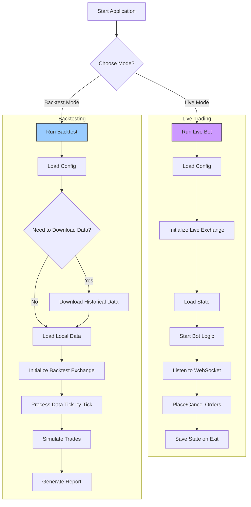

# Binance Futures Grid Trading Bot

[](https://golang.org/dl/)
[](https://opensource.org/licenses/MIT)
[](https://goreportcard.com/report/github.com/your-username/binance-grid-bot-go)

A high-frequency grid trading bot for Binance Futures, written in Go. It supports both live trading and historical data backtesting to help you develop and verify your trading strategies.

## Features

- **Live Trading Mode**: Connects to Binance API to trade in real-time.
- **Backtesting Mode**: Test your strategy on historical K-line data.
- **Automatic Data Downloader**: Automatically downloads historical data for backtesting.
- **State Persistence**: Saves the bot's state (grid orders) for graceful restarts in live mode.
- **Detailed Configuration**: Highly configurable via a `config.json` file.
- **Structured Logging**: Uses `zap` for structured, leveled logging.
- **Backtest Reporting**: Generates a performance report after each backtest run.

## Architecture

The bot's workflow is divided into two main modes: Live Trading and Backtesting.



## Getting Started

### Prerequisites

- [Go](https://golang.org/dl/) version 1.23 or higher.
- A Binance account with API keys (for live trading).

### Installation

1.  Clone the repository:
    ```bash
    git clone https://github.com/your-username/binance-grid-bot-go.git
    cd binance-grid-bot-go
    ```

2.  Install dependencies:
    ```bash
    go mod tidy
    ```

3.  Build the executable:
    ```bash
    go build -o grid-bot ./cmd/bot/main.go
    ```

### Configuration

Before running the bot, you need to set up your `config.json` file.

1.  Rename `config.example.json` to `config.json` (or create a new one).
2.  Edit the parameters:

| Parameter         | Type    | Description                                                                                             |
| ----------------- | ------- | ------------------------------------------------------------------------------------------------------- |
| `APIKey`          | string  | Your Binance API Key.                                                                                   |
| `SecretKey`       | string  | Your Binance Secret Key.                                                                                |
| `IsTestnet`       | boolean | Set to `true` to use the Binance Testnet, `false` for the production environment.                       |
| `Symbol`          | string  | The trading symbol (e.g., "BTCUSDT"). This is the default for live mode.                                |
| `GridSpacing`     | float64 | The spacing between grid lines (e.g., 0.005 for 0.5%).                                                  |
| `GridValue`       | float64 | The value (in quote currency) for each grid order.                                                      |
| `Leverage`        | int     | The leverage to use for trading.                                                                        |
| `ReturnRate`      | float64 | The expected price return ratio that triggers the bot to reset its grid (e.g., 0.2 for 20%).            |
| `MaxActiveGrids`  | int     | The maximum number of active buy and sell orders at any time.                                           |
| `LogConfig`       | object  | Configuration for logging (`Level`, `Path`, `MaxSize`, `MaxBackups`, `MaxAge`, `Compress`).               |

## Usage

The bot can be started via the command line with different flags to control its operation.

### Live Trading Mode

This is the default mode. It will connect to Binance and start trading based on your configuration.

```bash
./grid-bot --config config.json --mode live
```

The bot will save its state to `grid_state.json` upon graceful shutdown (Ctrl+C).

### Backtesting Mode

The backtest mode allows you to test your strategy on historical data.

#### Option 1: Auto-Download Data

The bot can download the required K-line data for you. Specify the symbol, start date, and end date.

```bash
./grid-bot --mode backtest --symbol BNBUSDT --start 2024-01-01 --end 2024-02-01
```
The data will be saved as a `.csv` file in the `data/` directory.

#### Option 2: Use Local Data

If you already have a `.csv` file with historical data, you can use the `--data` flag. The symbol will be automatically inferred from the filename (e.g., `BNBUSDT-2024-01-01-2024-02-01.csv` -> `BNBUSDT`).

```bash
./grid-bot --mode backtest --data data/BNBUSDT-2024-01-01-2024-02-01.csv
```

After the backtest is complete, a detailed performance report will be printed to the console.

## Development

Contributions are welcome! Please feel free to submit a pull request or open an issue.

## Disclaimer

Trading cryptocurrencies involves high risk and may not be suitable for all investors. The use of trading bots can result in substantial financial losses. Use this software at your own risk. The authors are not responsible for any financial losses you may incur.

## License

This project is licensed under the MIT License - see the [LICENSE](LICENSE) file for details.
